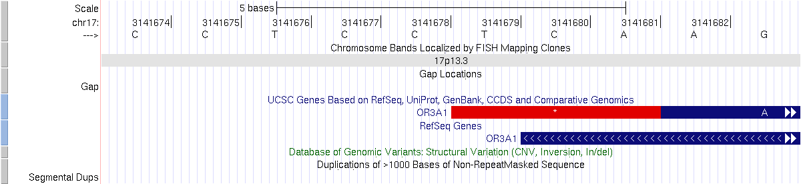

## Command overview

IMPORTANT: if you are a new user to ANNOVAR, do NOT use annotate_variation.pl for gene annotation. Simply use table_annovar.pl as shown in the quick start-up guide. The table_annovar.pl actually runs a series of commands including annotate_variation and coding_change and performs tasks such as annotation polishing and cDot generation for intronic variants.

<strong>IMPORTANT: Again do not use annotate_variation unless you are an expert and know the intricate differences of the many arguments. Only use table_annovar for your annotation needs. See examples in the quick start-up guide. Many users generate incorrect results by annotate_variation.pl because they do not know how to perform polishing, which is why table_annovar was created to help users get the most reliable set of annotations in an easy manner. </strong>

One of the functionalities of ANNOVAR is to generate gene-based annotation. For example, from a whole-genome sequencing experiment on a human subject, given a list of 4 million SNVs (single nucleotide variants) and 0.5 million indels (insertions or deletions), it is of interest to identify the genes that are disrupted. For intergenic variants, we are interested in knowing what are the two flanking genes, and what are the distances between the variants and the flanking genes. For exonic variants, we are interested in knowing the amino acid changes.

Before working on gene-based annotation, a gene definition file and associated FASTA file must be downloaded into a directory if they are not already downloaded. Let's call this directory as `humandb/`.

```
[kaiwang@biocluster ~/]$ annotate_variation.pl -downdb -buildver hg19 -webfrom annovar refGene humandb/
NOTICE: Web-based checking to see whether ANNOVAR new version is available ... Done
NOTICE: Downloading annotation database http://www.openbioinformatics.org/annovar/download/hg19_refGene.txt.gz ... OK
NOTICE: Downloading annotation database http://www.openbioinformatics.org/annovar/download/hg19_refLink.txt.gz ... OK
NOTICE: Downloading annotation database http://www.openbioinformatics.org/annovar/download/hg19_refGeneMrna.fa.gz ... OK
NOTICE: Uncompressing downloaded files
NOTICE: Finished downloading annotation files for hg19 build version, with files saved at the 'humandb' directory
```

This command downloads a few files and save them in the `humandb/` directory for later use.

> *Technical Notes: The above command includes `-webfrom annovar`, because I already pre-built the FASTA file and included them in ANNOVAR distribution site. For other gene definition systems (such as GENCODE, CCDS) or for other species (such as mouse/fly/worm/yeast), the user needs to build the FASTA file yourself. See below for more details.*

Suppose we use the input file `ex1.avinput` which is included as an example in the ANNOVAR package. This is a simple text file, and its content is displayed below:

```
[kaiwang@biocluster ~/]$ cat example/ex1.avinput
1 948921 948921 T C comments: rs15842, a SNP in 5' UTR of ISG15
1 1404001 1404001 G T comments: rs149123833, a SNP in 3' UTR of ATAD3C
1 5935162 5935162 A T comments: rs1287637, a splice site variant in NPHP4
1 162736463 162736463 C T comments: rs1000050, a SNP in Illumina SNP arrays
1 84875173 84875173 C T comments: rs6576700 or SNP_A-1780419, a SNP in Affymetrix SNP arrays
1 13211293 13211294 TC - comments: rs59770105, a 2-bp deletion
1 11403596 11403596 - AT comments: rs35561142, a 2-bp insertion
1 105492231 105492231 A ATAAA comments: rs10552169, a block substitution
1 67705958 67705958 G A comments: rs11209026 (R381Q), a SNP in IL23R associated with Crohn's disease
2 234183368 234183368 A G comments: rs2241880 (T300A), a SNP in the ATG16L1 associated with Crohn's disease
16 50745926 50745926 C T comments: rs2066844 (R702W), a non-synonymous SNP in NOD2
16 50756540 50756540 G C comments: rs2066845 (G908R), a non-synonymous SNP in NOD2
16 50763778 50763778 - C comments: rs2066847 (c.3016_3017insC), a frameshift SNP in NOD2
13 20763686 20763686 G - comments: rs1801002 (del35G), a frameshift mutation in GJB2, associated with hearing loss
13 20797176 21105944 0 - comments: a 342kb deletion encompassing GJB6, associated with hearing loss
```

Read the "[Prepare Input Files](input.md)" section to understand the file format. Basically, only the first five columns are used by ANNOVAR, and the following fields are optional and can be anything, like quality scores, confidence score, comments, identifiers, etc.

The gene-based annotation can be issued by the following command (by default, `--geneanno -dbtype refGene` is assumed):

```
[kaiwang@biocluster ~/]$ annotate_variation.pl -out ex1 -build hg19 example/ex1.avinput humandb/
NOTICE: The --geneanno operation is set to ON by default
NOTICE: Reading gene annotation from humandb/hg19_refGene.txt ... Done with 48660 transcripts (including 10375 without coding sequence annotation) for 25588 unique genes
NOTICE: Reading FASTA sequences from humandb/hg19_refGeneMrna.fa ... Done with 14 sequences
WARNING: A total of 333 sequences will be ignored due to lack of correct ORF annotation
NOTICE: Finished gene-based annotation on 15 genetic variants in example/ex1.avinput
NOTICE: Output files were written to ex1.variant_function, ex1.exonic_variant_function
```

Two output files will be generated: `ex1.variant_function` and `ex1.exonic_variant_function` (to change the output file names, use the `--outfile` argument).

### Output file 1 (refSeq gene annotation)

The first file contains annotation for all variants, by adding two columns to the beginning of each input line (for example, "intronic DDR2" below in the first line):

```
[kaiwang@biocluster ~/]$ cat ex1.variant_function 
UTR5 ISG15(NM_005101:c.-33T>C) 1 948921 948921 T C comments: rs15842, a SNP in 5' UTR of ISG15
UTR3 ATAD3C(NM_001039211:c.*91G>T) 1 1404001 1404001 G T comments: rs149123833, a SNP in 3' UTR of ATAD3C
splicing NPHP4(NM_001291593:exon19:c.1279-2T>A,NM_001291594:exon18:c.1282-2T>A,NM_015102:exon22:c.2818-2T>A) 1 5935162 5935162 A T comments: rs1287637, a splice site variant in NPHP4
intronic DDR2 1 162736463 162736463 C T comments: rs1000050, a SNP in Illumina SNP arrays
intronic DNASE2B 1 84875173 84875173 C T comments: rs6576700 or SNP_A-1780419, a SNP in Affymetrix SNP arrays
intergenic LOC645354(dist=11566),LOC391003(dist=116902) 1 13211293 13211294 TC - comments: rs59770105, a 2-bp deletion
intergenic UBIAD1(dist=55105),PTCHD2(dist=135699) 1 11403596 11403596 - AT comments: rs35561142, a 2-bp insertion
intergenic LOC100129138(dist=872538),NONE(dist=NONE) 1 105492231 105492231 A ATAAA comments: rs10552169, a block substitution
exonic IL23R 1 67705958 67705958 G A comments: rs11209026 (R381Q), a SNP in IL23R associated with Crohn's disease
exonic ATG16L1 2 234183368 234183368 A G comments: rs2241880 (T300A), a SNP in the ATG16L1 associated with Crohn's disease
exonic NOD2 16 50745926 50745926 C T comments: rs2066844 (R702W), a non-synonymous SNP in NOD2
exonic NOD2 16 50756540 50756540 G C comments: rs2066845 (G908R), a non-synonymous SNP in NOD2
exonic NOD2 16 50763778 50763778 - C comments: rs2066847 (c.3016_3017insC), a frameshift SNP in NOD2
exonic GJB2 13 20763686 20763686 G - comments: rs1801002 (del35G), a frameshift mutation in GJB2, associated with hearing loss
exonic CRYL1,GJB6 13 20797176 21105944 0 - comments: a 342kb deletion encompassing GJB6, associated with hearing loss
```

The first column tells whether the variant hit exons or hit intergenic regions, or hit introns, or hit a non-coding RNA genes. If the variant is exonic/intronic/ncRNA, the second column gives the gene name (if multiple genes are hit, comma will be added between gene names); if not, the second column will give the two neighboring genes and the distance to these neighboring genes.

The possible values of the first column is summarized below:

| Value	|	Default precedence	|	Explanation	| Sequence Ontology |
|---|---|---|---|
| exonic	|	1	|	variant overlaps a coding | exon_variant (SO:0001791)	|
|	splicing	|	1	|	variant is within 2-bp of a splicing junction (use -splicing_threshold to change this)	| splicing_variant (SO:0001568) |
|	ncRNA	|	2	|	variant overlaps a transcript without coding annotation in the gene definition (see Notes below for more explanation)	| non_coding_transcript_variant (SO:0001619) |
|	UTR5	|	3	|	variant overlaps a 5' untranslated region	| 5_prime_UTR_variant (SO:0001623) |
|	UTR3	|	3	|	variant overlaps a 3' untranslated region	| 3_prime_UTR_variant (SO:0001624) |
|	intronic	|	4	|	variant overlaps an intron	| intron_variant (SO:0001627) | 
|	upstream	|	5	|	variant overlaps 1-kb region upstream of transcription start site	| upstream_gene_variant (SO:0001631) |
|	downstream	|	5	|	variant overlaps 1-kb region downtream of transcription end site (use -neargene to change this)	| downstream_gene_variant (SO:0001632) |
|	intergenic	|	6	|	variant is in intergenic region	| intergenic_variant (SO:0001628) |


The value of the first column takes the following precedence (as of December 2010 and later version of ANNOVAR): exonic = splicing > ncRNA> > UTR5/UTR3 > intron > upstream/downstream > intergenic. The precedence defined above is used to decide what function to print out when a variant fit multiple functional categories. Note that:

1. the "exonic" here refers only to coding exonic portion , but not UTR portion, as there are two keywords (UTR5, UTR3) that are specifically reserved for UTR annotations.
2. "splicing" in ANNOVAR is defined as variant that is within 2-bp away from an exon/intron boundary by default, but the threshold can be changed by the --splicing_threshold argument. Before Feb 2013, if "exonic,splicing" is shown, it means that this is a variant within exon but close to exon/intron boundary; this behavior is due to historical reason, when a user requested that exonic variants near splicing sites be annotated with splicing as well. However, I continue to get user emails complaining about this behavior despite my best efforts to put explanation in the ANNOVAR website with details. Therefore, starting from Feb 2013 , "splicing" only refers to the 2bp in the intron that is close to an exon, and if you want to have the same behavior as before, add -exonicsplicing argument.
3. If a variant is located in both 5' UTR and 3' UTR region (possibly for two different genes), then the "UTR5,UTR3" will be printed as the output.
4. The term "upstream" and "downstream" is defined as 1-kb away from transcription start site or transcription end site, respectively, taking in account of the strand of the mRNA; the --neargene threshold can be used to adjust this threshold.
5. If a variant is located in both downstream and upstream region (possibly for 2 different genes), then the "upstream,downstream" will be printed as the output.
In 2011 June version of ANNOVAR, the splicing annotation is improved. If the splicing site is in intron, then all isoforms and the corresponding base change will be printed. For example,

```
splicing SMS(NM_004595:c.447+2T>G) X 21895357 21895357 T G hetero 8 15
splicing DMD(NM_004011:c.48+1A>C) X 31803228 31803228 T G homo 117 30
splicing BAGE(NM_001187:c.14+1A>G),BAGE4(NM_181704:c.14+1A>G),BAGE5(NM_182484:c.14+1A>G) 21 10120594 10120594 T C hetero 66 53
```

Several technical notes are discussed below.

> *Technical Notes: ncRNA above refers to RNA without coding annotation. It does not mean that this is a RNA that will never be translated; it merely means that the user-selected gene annotation system was not able to give a coding sequence annotation. It could still code protein products and may have such annotations in future versions of gene annotation or in another gene annotation system. For example, BC039000 is regarded as ncRNA by ANNOVAR when using UCSC Known Gene annotation, but it is regarded as a protein-coding gene by ANNOVAR when using ENSEMBL annotation. If the goal of the user is to find known (well-annotated) microRNA or other known (well-annotated) non-coding RNA, then the region-based annotation should be used and the wgRNA track should be selected. Read instructions here.*

> *Technical Notes: if the first codon of a transcript is deleted, it will be reported as wholegene deletion by ANNOVAR because the gene cannot be translated.*

If the users want to have all functional consequences printed out (rather than just the most important one defined by the precedence above), the `--separate` argument should be used. In this case, several output lines may be present for each variant, representing several possible functional consequences.

To further explain the variant_function annotation, check the figure below:


In the figure above, SNP1 is an intergenic variant, as it is >1kb away from any gene, SNP2 is a downstream variant, as it is 1kb from the 3'end of the NADK gene; SNP3 is a UTR3 variant; SNP4 is an intronic variant; SNP5 is an exonic variant.

Similarly, Deletion 1 is an intergenic variant; deletion 2 is a downstream variant; deletion3 is a UTR3 variant; deletion 4 overlaps both with UTR3 and intron, and based on the precedence rule, it is a UTR3 variant; deletion 5 is an intronic variant; deletion6 overlaps with both an exon and an intron, and based on the precedence rule, it is an exonic variant.

> *Technical Notes: Sometimes users may want to change the default precedence rule. The "-precedence" argument can be used to fine-tune the priority of variant function. The different variant functions should be separated by comma in the command line based on their desired priority levels. The allowable keywords for variant functions are exonic, intronic, splicing, utr5, utr3, upstream, downstream, splicing, ncrna.*

For example, when `-precedence intronic,utr5,utr3` is specified, the intronic variant will take precedence over UTR variants, and the deletion 4 will become an intronic variant above. This is the only change, and all other default precedence rule still applies here.

> *Technical Notes: By default, the gene name is printed in the second column in the variant_function file. Sometimes, a user may want to see transcript name instead. The --transcript_function argument can be used to specify this behavior. Note that it is very likely that multiple transcript names will be printed in the output separated by comma, as each gene name typically corresponds to several transcript names.*

> *Technical Notes: Current logic in gene definition: Genomes are complex and therefore gene definitions are also complex. ANNOVAR completely relies on user-supplied gene definitions (such as RefSeq, UCSC Gene and Ensembl Gene) to map a transcript to genomes and relate transcripts to genes, and uses the following logic to handle complex scenarios:
1. If a gene is annotated as both coding and non-coding (multiple transcripts, some coding, some non-coding), the gene will be regarded as coding (the non-coding transcript definition will be ignored).
2. If a gene or a transcript has one or several non-coding definitions but without coding definition, it will be regarded as ncRNA in annotation output. 
3. If a transcript maps to multiple locations as "coding transcripts", but some with complete ORF, some without complete ORF (that is, with premature stop codon), then the ones without complete ORF will be ignored.
4. If a transcript maps to multiple locations, all as "coding transcripts", but none has a complete ORF, then this transcript will not be used in exonic_variant_function annotation and the corresponding annotation will be marked as "UNKNOWN". 
5. NEW in July 2014: If a transcript maps to multiple genomic locations, all mapping wil be used in the annotation process. Previously, only the "most likely" mapping will be used in annotation.*

The above rules do make sense. The rule 3 and 4 were made in Nov 2011 version of ANNOVAR (so that users no longer send me emails complaining errors in exonic annotation which is not really a fault of ANNOVAR per se). But as a result, you may see more "UNKNOWN" exonic annotations in the output file.

### Output file 2 (refSeq gene annotation)

The second output file, `ex1.exonic_variant_function`, contains the amino acid changes as a result of the exonic variant. The exact format of the output below may change slightly between different versions of ANNOVAR.

```
[kaiwang@biocluster ~/]$ cat ex1.exonic_variant_function 
line9 nonsynonymous SNV IL23R:NM_144701:exon9:c.G1142A:p.R381Q, 1 67705958 67705958 G A comments: rs11209026 (R381Q), a SNP in IL23R associated with Crohn's disease
line10 nonsynonymous SNV ATG16L1:NM_001190267:exon9:c.A550G:p.T184A,ATG16L1:NM_017974:exon8:c.A841G:p.T281A,ATG16L1:NM_001190266:exon9:c.A646G:p.T216A,ATG16L1:NM_030803:exon9:c.A898G:p.T300A,ATG16L1:NM_198890:exon5:c.A409G:p.T137A, 2 234183368 234183368 A G comments: rs2241880 (T300A), a SNP in the ATG16L1 associated with Crohn's disease
line11 nonsynonymous SNV NOD2:NM_022162:exon4:c.C2104T:p.R702W,NOD2:NM_001293557:exon3:c.C2023T:p.R675W, 16 50745926 50745926 C comments: rs2066844 (R702W), a non-synonymous SNP in NOD2
line12 nonsynonymous SNV NOD2:NM_022162:exon8:c.G2722C:p.G908R,NOD2:NM_001293557:exon7:c.G2641C:p.G881R, 16 50756540 50756540 G comments: rs2066845 (G908R), a non-synonymous SNP in NOD2
line13 frameshift insertion NOD2:NM_022162:exon11:c.3017dupC:p.A1006fs,NOD2:NM_001293557:exon10:c.2936dupC:p.A979fs, 16 50763778 5076377comments: rs2066847 (c.3016_3017insC), a frameshift SNP in NOD2
line14 frameshift deletion GJB2:NM_004004:exon2:c.35delG:p.G12fs, 13 20763686 20763686 G - comments: rs1801002 (del35G), a frameshift mutation in GJB2, associated with hearing loss
line15 frameshift deletion GJB6:NM_001110221:wholegene,GJB6:NM_001110220:wholegene,GJB6:NM_001110219:wholegene,CRYL1:NM_015974:wholegene,GJB6:NM_006783:wholegene, 13 20797176 21105944 0 - comments: a 342kb deletion encompassing GJB6, associated with hearing loss
```

Note that only exonic variants are annotated in this file, so the first column gives the line # in the original input file. The second field tells the functional consequences of the variant (possible values in this fields include: nonsynonymous SNV, synonymous SNV, frameshift insertion, frameshift deletion, nonframeshift insertion, nonframeshift deletion, frameshift block substitution, nonframshift block substitution). The third column contains the gene name, the transcript identifier and the sequence change in the corresponding transcript. A standard nomenclature is used in specifying the sequence changes (you may want to add -hgvs argument so that the cDNA level annotation is compatible with HGVS nomenclature).

More detailed explanation of these exonic_variant_functoin annotations are given below. Note that stopgain and stoploss take precedence over other annotations; for example, whenever a nonsynonymous mutation change the wild type amino acid to a stop codon, it will be annotated as stopgain rather than nonsynonymous SNV.

|	Annotation	|	Precedence	|	Explanation	| Sequence Ontology |
|---|---|---|---|
| frameshift insertion	| 1	| an insertion of one or more nucleotides that cause frameshift changes in protein coding sequence  | frameshift_elongation (SO:0001909) |
| frameshift deletion	| 2	| a deletion of one or more nucleotides that cause frameshift changes in protein coding sequence    | frameshift_truncation (SO:0001910) |
| frameshift block substitution	| 3	| a block substitution of one or more nucleotides that cause frameshift changes in protein coding sequence  | frameshift_variant (SO:0001589) |
| stopgain	| 4	|  a nonsynonymous SNV, frameshift insertion/deletion, nonframeshift insertion/deletion or block substitution that lead to the immediate creation of stop codon at the variant site. For frameshift mutations, the creation of stop codon downstream of the variant will not be counted as "stopgain"!   | stop_gained (SO:0001587) |
| stoploss	| 5	|  a nonsynonymous SNV, frameshift insertion/deletion, nonframeshift insertion/deletion or block substitution that lead to the immediate elimination of stop codon at the variant site   | stop_lost (SO:0001578) |
| nonframeshift insertion	| 6	 |  an insertion of 3 or multiples of 3 nucleotides that do not cause frameshift changes in protein coding sequence  | inframe_insertion (SO:0001821) |
| nonframeshift deletion	| 7	 |  a deletion of 3 or mutliples of 3 nucleotides that do not cause frameshift changes in protein coding sequence   | inframe_deletion (SO:0001822) |
| nonframeshift block substitution	| 8	 |  a block substitution of one or more nucleotides that do not cause frameshift changes in protein coding sequence  | inframe_variant (SO:0001650) |
| nonsynonymous SNV	 |  9  |  a single nucleotide change that cause an amino acid change  | missense_variant (SO:0001583) |
| synonymous SNV  |  10  |  a single nucleotide change that does not cause an amino acid change  | synonymous_variant (SO:0001819) |
| unknown  |  11  |  unknown function (due to various errors in the gene structure definition in the database file)  | sequence_variant (SO:0001060) |


In 2012 Oct version of ANNOVAR, the `--aamatrixfile` argument is added so that users can print out GRANTHAM scores (or any other amino acid substitution matrix) for nonsynonymous variantsin gene-based annotation. See below, the `AAMatrix=43` notation is added to the output, indicating that the R->Q change has a grantham score of 43.

```
[kaiwang@biocluster ]$ annotate_variation.pl example/ex1.avinput humandb/ -aamatrixfile grantham.matrix -out ex1 -buildver hg19 
[kaiwang@biocluster ]$ head -n 1 ex1.exonic_variant_function
line9 nonsynonymous SNV IL23R:NM_144701:exon9:c.G1142A:p.R381Q:AAMatrix=43, 1 67705958 67705958 G A comments: rs11209026 (R381Q), a SNP in IL23R associated with Crohn's disease
```

When specifying amino acid changes, the specification always relates to a position for a transcript (not a "gene"). For example, the R702W mutation refers to an amino acid change at position 702 in exon 4 in a transcript called NM_022162 (which corresponds to the NOD2 gene). Since there is only one transcript annotated with the NOD2 gene, there is no ambiguity here. However, due to alternative splicing, if there are two or more transcripts that are all annotated for a gene, then the position of the amino acid change will differ, and it is important to always list the transcripts, in addition to gene names.

If the user is interested in using HGVS nomenclature for cDNA, add the `-hgvs` argument in gene annotation:

```
[kaiwang@biocluster ~/]$ annotate_variation.pl -out ex1 -build hg19 -hgvs example/ex1.avinput humandb/ 

[kaiwang@biocluster ~/]$ cat ex1.exonic_variant_function
line9 nonsynonymous SNV IL23R:NM_144701:exon9:c.1142G>A:p.R381Q, 1 67705958 67705958 G A comments: rs11209026 (R381Q), a SNP in IL23R associated with Crohn's disease
line10 nonsynonymous SNV ATG16L1:NM_030803:exon9:c.898A>G:p.T300A,ATG16L1:NM_017974:exon8:c.841A>G:p.T281A,ATG16L1:NM_001190267:exon9:c.550A>G:p.T184A,ATG16L1:NM_001190266:exon9:c.646A>G:p.T216A,ATG16L1:NM_198890:exon5:c.409A>G:p.T137A, 2 234183368 234183368 A G comments: rs2241880 (T300A), a SNP in the ATG16L1 associated with Crohn's disease
line11 nonsynonymous SNV NOD2:NM_001293557:exon3:c.2023C>T:p.R675W,NOD2:NM_022162:exon4:c.2104C>T:p.R702W, 16 50745926 50745926 comments: rs2066844 (R702W), a non-synonymous SNP in NOD2
line12 nonsynonymous SNV NOD2:NM_001293557:exon7:c.2641G>C:p.G881R,NOD2:NM_022162:exon8:c.2722G>C:p.G908R, 16 50756540 50756540 comments: rs2066845 (G908R), a non-synonymous SNP in NOD2
line13 frameshift insertion NOD2:NM_001293557:exon10:c.2936dupC:p.A979fs,NOD2:NM_022162:exon11:c.3017dupC:p.A1006fs, 16 50763778 5076377comments: rs2066847 (c.3016_3017insC), a frameshift SNP in NOD2
line14 frameshift deletion GJB2:NM_004004:exon2:c.35delG:p.G12fs, 13 20763686 20763686 G - comments: rs1801002 (del35G), a frameshift mutation in GJB2, associated with hearing loss
line15 frameshift deletion GJB6:NM_001110220:wholegene,GJB6:NM_001110221:wholegene,GJB6:NM_001110219:wholegene,CRYL1:NM_015974:wholegene,GJB6:NM_006783:wholegene, 13 20797176 21105944 0 - comments: a 342kb deletion encompassing GJB6, associated with hearing loss
```

> *Technical Note: Similar to the `variant_function` file, the `exonic_variant_function` file also follows the precedence rule, but users cannot change this rule (there is no much biological reason to change this rule anyway). For example, the mutation "chr7 140453136 140453136 A T" will be annotated as stoploss mutation X208R by ANNOVAR using ENSEMBL definition, because the stop loss takes precedence over the nonsynonymous mutation (V600E for ENST00000288602, V28E for ENST00000479537). If users want to have the comprehensive set of exonic_variant_function output, use the `-separate` argument!*

> *Technical Notes: Some genes have multiple transcripts and ANNOVAR may randomly sort the order of transcripts in the output file. For example, the same mutation may be annotated as "BRAF:ENST00000288602:exon15:c.T1799A:p.V600E,BRAF:ENST00000479537:exon2:c.T83A:p.V28E" from one input file, but as "BRAF:ENST00000479537:exon2:c.T83A:p.V28E,BRAF:ENST00000288602:exon15:c.T1799A:p.V600E" from another input file. Some users want absolute consistency in the annotation. In this case, you can add `-exonsort` argument to the command line, so that the exon2 always precede exon15 in the output file.*

> *Technical Notes: Many users requested to know the exact "new protein sequence" after observing an indel, as opposed to a simple "frameshift mutation" annotation. I cannot address this within ANNOVAR directly. To handle this situation, I implemented a new script that takes the output from the gene-annotation, and then re-calculate the wildtype and the mutated protein sequence, and infer if the indels or block substitutions cause stopgain, stoploss or nonsynonymous changes in the protein sequence. The script is `coding_change.pl` within ANNOVAR package. Try it and see how it works!*

> *Technical Notes: In previous versions of ANNOVAR, all the exonic annotations are based on user-specified gene definitions and user-specified FASTA sequences. However, this may create some problem: some gene definitions may lead to incorrect/imcomplete ORF with premature stop codon, and some times FASTA sequences are outdated compared to gene definitions. Although in principle users can easily identiy these problems by coding_change.pl script, some users do not want to go through the extra trouble. Therefore, in Nov 2011 version of ANNOVAR, I decided to identify transcripts with premature stop codon, and no longer annotate any exonic mutations to these transcripts (in other words, the exonic annotations will be marked as "UNKNOWN").*

## Including RefSeq gene version number

Since 2017 June, ANNOVAR package now includes `hg19_refGeneWithVer.txt` file to give an example how to annotate varians with refGene with versions. Instead of using `-dbtype refGene`, the users can use `-dbtype refGeneWithVer`, so that results will contain transcript identifiers with versions. For all other genome build, the user need to generate these files yourself.

## Annotating mitochrondria variants

ANNOVAR can annotate mitochondria variants as of Feb 2013 (as long as your chromosome identifier is M or MT or chrM or chrMT, the mitochondria-specific codon table will be used for inferring amino acid changes). However, there are several important caveats:

1. RefSeq does not have mitochondria gene definition. So ANNOVAR users need to use either UCSC Known Gene or Ensembl Gene.

2. UCSC's hg19 assembly used the old version mitochondria genome (NC_001807), but 1000 genomes cosortium has replace the chrM with the latest Cambridge Reference Sequence version (NC_012920). So if you align your sequence data and call variants against the NC_012920, then you cannot really annotate your variants using UCSC's gene definition. It is necessary to stick with the identical coordinate. To explain this better, when you get your raw sequence data as FASTQ files, if you align your data to reference genome compiled by UCSC (usually the file name is something like `hg19.fa`, and there are some chromosomes with name such as chrx_random), then you can directly use ANNOVAR to annotate all variants together. Mitochondria variants will be those that align to chrM, and Feb2013 version of ANNOVAR can correctly annotate them. Konrad Herbst from German Cancer Research Center wrote a script for positional conversion between both reference sequences (geared by some similar script in the MitoSeek package by Y. Guo et. al.) and used it to map the GRCh37 file to hg19 file. With `retrieve_seq_from_fasta.pl` used on the hg19 reference sequence (AF347015.1) the following files are produced for hg19-based mitochondria annotation.

    One complication that many users are not aware is that Ensemble has annotation errors (typically a few base pairs off) for mitochondria genes, so the gene annotation from Ensembl should not be used. Take a simple example, you can search ENST00000389680 in UCSC genome browser: while Gencode list the location as chrM:650-1603, Ensembl annotation comes out as chrM:646-1599, with 4bp off. For these reasons, you should use the file provided by ANNOVAR for any mitochondria annotation when you call variants on hg19 coordiante. 

    To make this easier to users, I now provide the two files here: `hg19_MT_ensGene.txt` and `hg19_MT_ensGeneMrna.fa` in ANNOVAR package `humandb/` directory. The `-buildver` is hg19_MT and `-dbtype` is ensGene. 

3. However, if you align your raw FASTQ files to reference genome that has NC_012920 (such as those provided by the 1000 Genomes Project, usually the file name is something like `human_g1k_v37.fasta`), then you need to use a custom gene definition file that has the correct mitochondria gene definition for NC_012920. Dr. Jun Ding from National Institute of Aging has graciously provided such files based on Ensemble definition. Note that the chromosome name should usually be MT (before June 2013, I used chrM in the file which caused confusion to some ANNOVAR users so I decided to change to MT and stick with the standard for GRCh37). In this case, you should use the following command for annotating mitochondria variants: `annotate_variation.pl -buildver GRCh37_MT -dbtype ensGene mt.avinput humandb/`. 

    To make this easier to users, I now provide the two files `GRCh37_MT_ensGene.txt.gz` and `GRCh37_MT_ensGeneMrna.fa.g`z in ANNOVAR package humandb/ directory. The `-buildver` is GRCh37_MT and `-dbtype` is ensGene.
 

## Switching to UCSC/Ensembl Gene annotation

ANNOVAR can optionally process UCSC Known Gene annotation or Ensembl Gene annotation, both of which are more comprehensive than RefSeq by including many poorly annotated or computationally predicted genes. An example is shown below to annotate variants using UCSC Known Gene:

```
[kaiwang@biocluster ~/]$ annotate_variation.pl -out ex1 -build hg19 example/ex1.avinput humandb/ -dbtype knownGene
NOTICE: The --geneanno operation is set to ON by default
NOTICE: Reading gene annotation from humandb/hg19_knownGene.txt ... Done with 78963 transcripts (including 18502 without coding sequence annotation) for 28495 unique genes
NOTICE: Reading FASTA sequences from humandb/hg19_knownGeneMrna.fa ... Done with 45 sequences
WARNING: A total of 43 sequences will be ignored due to lack of correct ORF annotation
NOTICE: Finished gene-based annotation on 15 genetic variants in example/ex1.avinput
NOTICE: Output files were written to ex1.variant_function, ex1.exonic_variant_function
```

The transcript name (in the `ex1.exonic_variant_function` file) look like uc002eg1.1, etc, which are UCSC Gene identifiers.

To annotate variants using Ensembl gene, use the commands below. The output format is similar to that described above. The "ENSG" and "ENST" are Ensembl identifiers for annotated genes and transcripts. 


```
[kaiwang@biocluster ~/]$ annotate_variation.pl -out ex1 -build hg19 ex1.hg19.avinput humandb/ -dbtype ensGene
NOTICE: The --geneanno operation is set to ON by default
NOTICE: Reading gene annotation from humandb/hg19_ensGene.txt ... Done with 196501 transcripts (including 101155 without coding sequence annotation) for 57905 unique genes
NOTICE: Reading FASTA sequences from humandb/hg19_ensGeneMrna.fa ... Done with 20 sequences
WARNING: A total of 6780 sequences will be ignored due to lack of correct ORF annotation
NOTICE: Finished gene-based annotation on 15 genetic variants in example/ex1.avinput
NOTICE: Output files were written to ex1.variant_function, ex1.exonic_variant_function
```

Since the output contains only Ensembl identifiers, if you want to translate that to gene synonym, you can download [this file for hg19](http://hgdownload.soe.ucsc.edu/goldenPath/hg19/database/ensemblToGeneName.txt.gz) and use the two-column file for the translation yourself. 

Comparing the program message ("Done with xxx transcripts for yyy unique genes") from three different gene-definition systems, we can see that Ensembl annotates the greatest number of genes in human genome, yet RefSeq annotates the fewest number of genes.

> *Technical Notes: Technically, the RefSeq Gene and UCSC Gene are transcript-based gene definitions. They built gene model based on transcript data, and then map the gene model back to human genomes. In comparison, Ensemble Gene and Gencode Gene are assembly-based gene definitions that attempt to build gene model directly from reference human genome. They came from different angles, trying to do the same thing: define genes in human genome.*

> *However, this has its own consequences. For example, RefSeq builds a gene model from assembling transcript data from a population, but the reference human genome may have an allele as minor allele in a population. In this case, the transcript may not align 100% to genome, resulting in discrepancies between the FASTA file for the transcript and the FASTA file generated from the whole-genome sequence (by concatenating exons together).*

> *For these reasons, accurate annotation of exonic variants cannot rely on cDNA sequences in the public databases, and can only be based on the actual chr:start-end site in the genome itself. For this reason, I built FASTA sequences for a few specific genomes, and users can download the sequences directly from ANNOVAR website; I also provide programs (retrieve_seq_from_fasta.pl) to build FASTA sequences for any other genomes for which I do not provide pre-built files.*

> *For these reasons, the FASTA seuqence in the file provided by me may differ from the FASTA sequence that you get from RefSeq. The sequence used by ANNOVAR are "theoretical" seuqence based on a particular genome build and assembly, but the FASTA sequence compiled by RefSeq are "observed" sequence from large databases without any relationship to a particular assembly version. They may have the same identifier but they are different things.*


## Switching to hg38 Ensembl gene annotation

Note that ensGene for the hg38 is not made available by UCSC Genome Browser. A user pointed out that UCSC have replaced the ensGene.txt using GENCODE starting from version 22 (see https://groups.google.com/a/soe.ucsc.edu/forum/#!topic/genome/uOROZuefx_Y). Therefore, if you want to annotate Ensemble genes based on hg38, you should use the Gencode file instead.

In September 2017, per user request, I prepared ensGene for hg38 directly within ANNOVAR now, using version 26 GENCODE Basic. The commands that I used to build this file are shown below for your reference:

```
annotate_variation.pl -downdb wgEncodeGencodeBasicV26 tempdir -build hg38
retrieve_seq_from_fasta.pl -format genericGene -seqfile humandb/hg38_seq/hg38.fa -outfile tempdir/hg38_wgEncodeGencodeBasicV26Mrna.fa tempdir/hg38_wgEncodeGencodeBasicV26.txt
mv hg38_wgEncodeGencodeBasicV26.txt hg38_ensGene.txt
mv hg38_wgEncodeGencodeBasicV26Mrna.fa hg38_ensGeneMrna.fa
```

Now I just upload these files to ANNOVAR database respository so that users can directly do a `-build hg38 -downdb ensGene dir/` to download hg38 version of ensGene and perform gene-based annotation using Ensemble keywords.


## Switching to GENCODE/CCDS Gene annotation

Current version of ANNOVAR does not provide a specific keyword for GENCODE, but ANNOVAR is versatile enough to handle GENCODE or whatever other gene definitions just fine. The GENCODE system has changed a lot in the past a few years, with the latest version being V19 as of February 2014. In V19, the BASIC track is available now which contains high-quality gene definitions based on the description: "The GENCODE Basic Set is intended to provide a simplified subset of the GENCODE transcript annotations that will be useful to the majority of users. The goal was to have a high-quality basic set that also covered all loci. Selection of GENCODE annotations for inclusion in the basic set was determined independently for the coding and non-coding transcripts at each gene locus."

Below is the command that I can use for GENCODE gene definitions for variant annotation (note that if whole-genome FASTA files are not available in `humandb/hg19_seq`, you should first do a `annotate_variation.pl -downdb -build hg19 seq humandb/hg19_seq/`).

```
[kaiwang@biocluster ~/]$ annotate_variation.pl -downdb wgEncodeGencodeBasicV19 humandb/ -build hg19
NOTICE: Web-based checking to see whether ANNOVAR new version is available ... Done
NOTICE: Downloading annotation database http://hgdownload.cse.ucsc.edu/goldenPath/hg19/database/wgEncodeGencodeBasicV19.txt.gz ... OK
NOTICE: Uncompressing downloaded files
NOTICE: Finished downloading annotation files for hg19 build version, with files saved at the 'humandb' directory

[kaiwang@biocluster ~/]$ retrieve_seq_from_fasta.pl -format genericGene -seqdir humandb/hg19_seq/ -outfile humandb/hg19_wgEncodeGencodeBasicV19Mrna.fa humandb/hg19_wgEncodeGencodeBasicV19.txt 

[kaiwang@biocluster ~/]$ annotate_variation.pl -build hg19 -out ex1 -dbtype wgEncodeGencodeBasicV19 example/ex1.avinput humandb/ 
NOTICE: The --geneanno operation is set to ON by default
NOTICE: Reading gene annotation from humandb/hg19_wgEncodeGencodeBasicV19.txt ... Done with 95929 transcripts (including 38291 without coding sequence annotation) for 42594 unique genes
NOTICE: Reading FASTA sequences from humandb/hg19_wgEncodeGencodeBasicV19Mrna.fa ... Done with 16 sequences
WARNING: A total of 303 sequences will be ignored due to lack of correct ORF annotation
NOTICE: Finished gene-based annotation on 15 genetic variants in example/ex1.avinput
NOTICE: Output files were written to ex1.variant_function, ex1.exonic_variant_function
Then check the results below:

[kaiwang@biocluster ~/]$ cat ex1.variant_function
UTR5 ISG15(ENST00000379389.4:c.-33T>C) 1 948921 948921 T C comments: rs15842, a SNP in 5' UTR of ISG15
UTR3 ATAD3C(ENST00000378785.2:c.*91G>T) 1 1404001 1404001 G T comments: rs149123833, a SNP in 3' UTR of ATAD3C
splicing NPHP4(ENST00000378156.4:exon22:c.2818-2T>A) 1 5935162 5935162 A T comments: rs1287637, a splice site variant in NPHP4
intronic DDR2 1 162736463 162736463 C T comments: rs1000050, a SNP in Illumina SNP arrays
intronic DNASE2B 1 84875173 84875173 C T comments: rs6576700 or SNP_A-1780419, a SNP in Affymetrix SNP arrays
intergenic RP13-221M14.3(dist=46825),PRAMEF26(dist=5062) 1 13211293 13211294 TC - comments: rs59770105, a 2-bp deletion
intergenic UBIAD1(dist=48375),PTCHD2(dist=135699) 1 11403596 11403596 - AT comments: rs35561142, a 2-bp insertion
intergenic RP11-364B6.1(dist=872522),RP11-251P6.1(dist=652543) 1 105492231 105492231 A ATAAA comments: rs10552169, a block substitution
exonic IL23R 1 67705958 67705958 G A comments: rs11209026 (R381Q), a SNP in IL23R associated with Crohn's disease
exonic ATG16L1 2 234183368 234183368 A G comments: rs2241880 (T300A), a SNP in the ATG16L1 associated with Crohn's disease
exonic NOD2 16 50745926 50745926 C T comments: rs2066844 (R702W), a non-synonymous SNP in NOD2
exonic NOD2 16 50756540 50756540 G C comments: rs2066845 (G908R), a non-synonymous SNP in NOD2
exonic NOD2 16 50763778 50763778 - C comments: rs2066847 (c.3016_3017insC), a frameshift SNP in NOD2
exonic GJB2 13 20763686 20763686 G - comments: rs1801002 (del35G), a frameshift mutation in GJB2, associated with hearing loss
exonic CRYL1,GJB6 13 20797176 21105944 0 - comments: a 342kb deletion encompassing GJB6, associated with hearing loss

[kaiwang@biocluster ~/]$ cat ex1.exonic_variant_function
line9 nonsynonymous SNV IL23R:ENST00000395227.1:exon4:c.G377A:p.R126Q,IL23R:ENST00000347310.5:exon9:c.G1142A:p.R381Q, 1 67705958 6770595comments: rs11209026 (R381Q), a SNP in IL23R associated with Crohn's disease
line10 nonsynonymous SNV ATG16L1:ENST00000373525.5:exon6:c.A466G:p.T156A,ATG16L1:ENST00000347464.5:exon5:c.A409G:p.T137A,ATG16L1:ENST00000392018.1:exon10:c.A949G:p.T317A,ATG16L1:ENST00000392017.4:exon9:c.A898G:p.T300A,ATG16L1:ENST00000392020.4:exon8:c.A841G:p.T281A, 2 234183368 234183368 comments: rs2241880 (T300A), a SNP in the ATG16L1 associated with Crohn's disease
line11 nonsynonymous SNV NOD2:ENST00000300589.2:exon4:c.C2104T:p.R702W, 16 50745926 50745926 C T comments: rs2066844 (R702W), a non-synonymous SNP in NOD2
line12 nonsynonymous SNV NOD2:ENST00000300589.2:exon8:c.G2722C:p.G908R, 16 50756540 50756540 G C comments: rs2066845 (G908R), a non-synonymous SNP in NOD2
line13 frameshift insertion NOD2:ENST00000300589.2:exon11:c.3017dupC:p.A1006fs, 16 50763778 50763778 - C comments: rs2066847 (c.3016_3017insC), a frameshift SNP in NOD2
line14 frameshift deletion GJB2:ENST00000382848.4:exon2:c.35delG:p.G12fs,GJB2:ENST00000382844.1:exon1:c.35delG:p.G12fs, 13 20763686 2076368comments: rs1801002 (del35G), a frameshift mutation in GJB2, associated with hearing loss
line15 frameshift deletion GJB6:ENST00000241124.6:wholegene,CRYL1:ENST00000298248.7:wholegene,GJB6:ENST00000400065.3:wholegene,CRYL1:ENST00000382812.1:wholegene,GJB6:ENST00000356192.6:wholegene,GJB6:ENST00000400066.3:wholegene, 13 20797176 21105944 0 - comments: a 342kb deletion encompassing GJB6, associated with hearing loss
Similarly, you can switch to Comprehensive annotations and PolyA annotations of GENCODE, by using a different -dbtype argument (wgEncodeGencodeCompV19 and wgEncodeGencodePolyaV19).
```

When using these annotations, it is important to always note the correct file name to use (use Table Browser in UCSC Genome Browser if you are not sure about table names).

Many other gene definition systems are also supported. For example, users can pick CCDS gene definition. (Note that if whole-genome FASTA files are not available in `humandb/hg19_seq`, you should first do a `annotate_variation.pl -downdb -build hg19 seq humandb/hg19_seq/`).

```
[kaiwang@biocluster ~/]$ annotate_variation.pl -downdb -build hg19 ccdsGene humandb

[kaiwang@biocluster ~/]$ retrieve_seq_from_fasta.pl humandb/hg19_ccdsGene.txt -seqdir humandb/hg19_seq -format refGene -outfile humandb/hg19_ccdsGeneMrna.fa

[kaiwang@biocluster ~/]$ annotate_variation.pl -buildver hg19 -out ex1 -dbtype ccdsGene example/ex1.avinput humandb/
NOTICE: The --geneanno operation is set to ON by default
NOTICE: Reading gene annotation from humandb/hg19_ccdsGene.txt ... Done with 29045 transcripts (including 0 without coding sequence annotation) for 29014 unique genes
NOTICE: Reading FASTA sequences from humandb/hg19_ccdsGeneMrna.fa ... Done with 8 sequences
WARNING: A total of 38 sequences will be ignored due to lack of correct ORF annotation
NOTICE: Finished gene-based annotation on 15 genetic variants in example/ex1.avinput
NOTICE: Output files were written to ex1.variant_function, ex1.exonic_variant_function
```

> *Technical Notes: for CCDS gene, the output will not contain gene name, but the CCDS identifiers only. To get the gene name, users have to write your own program to process ANNOVAR output files. There are two tables that can be used to convert CCDS ID to other ID: ccdsNotes convert CCDS to UCSC Known Genes transcript ID, and then you can convert this to Gene name. The ccdsInfo table converts CCDS ID to ENSEMBL transcript or RefSeq transcript, and then you can further convert them to Gene name.*

## Create your own gene definition databases for non-human species

Besides human genome, other species can be handled. However, ANNOVAR does not provide built-in mRNA FASTA files for other gene definitions, so users have to build it yourself.

To understand this more, try to handle the chimp genome:

```
[kai@beta ~/]$ annotate_variation.pl -downdb -buildver panTro2 gene chimpdb
NOTICE: Downloading annotation database ftp://hgdownload.cse.ucsc.edu/goldenPath/panTro2/database/refGene.txt.gz ... OK 
NOTICE: Downloading annotation database ftp://hgdownload.cse.ucsc.edu/goldenPath/panTro2/database/refLink.txt.gz ... OK 
NOTICE: Downloading annotation database http://www.openbioinformatics.org/annovar/download/panTro2_refGeneMrna.fa.gz ... Failed
NOTICE: Uncompressing downloaded files
NOTICE: Finished downloading annotation files for panTro2 build version, with files saved at the 'chimpdb' directory
WARNING: Some files cannot be downloaded, including http://www.openbioinformatics.org/annovar/download/panTro2_refGeneMrna.fa.gz
--------------------------------IMPORTANT---------------------------------
--------------------------------------------------------------------------
NOTICE: the FASTA file http://www.openbioinformatics.org/annovar/download/panTro2_refGeneMrna.fa.gz is not available to download but can be generated by the ANNOVAR software. PLEASE RUN THE FOLLOWING TWO COMMANDS CONSECUTIVELY TO GENERATE THE FASTA FILES:
annotate_variation.pl --buildver panTro2 --downdb seq chimpdb/panTro2_seq
retrieve_seq_from_fasta.pl chimpdb/panTro2_refGene.txt -seqdir chimpdb/panTro2_seq -format refGene -outfile chimpdb/panTro2_refGeneMrna.fa
--------------------------------------------------------------------------
--------------------------------------------------------------------------

The above command will run, but will print out some warning message: the FASTA sequences are not provided in ANNOVAR website so users need to build them. Just follow the exact intructions and run the two commands:

[kai@beta ~/]$ annotate_variation.pl --buildver panTro2 --downdb seq chimpdb/panTro2_seq
NOTICE: Downloading annotation database ftp://hgdownload.cse.ucsc.edu/goldenPath/panTro2/bigZips/chromFa.zip ... Failed
NOTICE: Downloading annotation database ftp://hgdownload.cse.ucsc.edu/goldenPath/panTro2/bigZips/chromFa.tar.gz ... OK 
NOTICE: Uncompressing downloaded files
NOTICE: Finished downloading annotation files for panTro2 build version, with files saved at the 'chimpdb/panTro2_seq' directory

[kai@beta ~/]$ retrieve_seq_from_fasta.pl chimpdb/panTro2_refGene.txt -seqdir chimpdb/panTro2_seq -format refGene -outfile chimpdb/panTro2_refGeneMrna.fa
NOTICE: Finished reading 1 sequences from chimpdb/panTro2_seq/12/chr12_random.fa
NOTICE: Finished reading 1 sequences from chimpdb/panTro2_seq/22/chr22.fa
NOTICE: Finished reading 1 sequences from chimpdb/panTro2_seq/14/chr14.fa
......
......
NOTICE: Finished writting FASTA for 1337 genomic regions to chimpdb/panTro2_refGeneMrna.fa.
```

So after running the above commands, the gene annotation database for the chimp genome would be complete, accurate and most up-to-date.

> *Exercise: Try to run the same procedure described above for rheMac2 (Macaque), and see how this differ from panTro2. UCSC did not utilize the same file naming convention or directory structuring rules for different genomes, and this makes the life of programmers more complicated. ANNOVAR can handle many genomes, but there will be another genome for which ANNOVAR cannot retrieve sequence automatically; if that is the case, please report to me and I will invesigate and add the functionality.*

> *Exercise: Try to run the same procedure above for sacCer2 (yeast) and see how this differs.*

> *Exercise: Try to run the same procedure above for sacCer3 (yeast) and see how this differs. Note that UCSC uses ncbiRefSeq instead of RefGene to denote gene annotation, so you have to use this in the -downdb command. Then use `retrieve_seq_from_fasta.pl yeastdb/sacCer3_ncbiRefSeq.txt -seqdir yeastdb/sacCer3_seq/ -format refGene -outfile yeastdb/sacCer3_refGeneMrna.fa` to generate the mRNA FASTQ file.*

> *Exercise: Try to run the same procedure above for bosTau6 (cow). Note that as of April 2012, UCSC has not split the FASTA file for bosTau6 genome sequence into individual chromosomes. Therefore, users need to use "-seqfile bosTau6.fa", rather than "-seqdir cowdb/bosTau6_seq", in the retrieve_seq_from_fasta.pl command. Similarly, try to run the same procedure above for micMur1 (Mouse Lemur) and note the use of -seqfile rather than -seqdir.*

> *Exercise: Try to run the same procedure above for rn5 (rat) or dm6 (Drosophila). Again users need to supply FASTA files rather than FASTA directory.*

The above procedure will only work if the gene-based annotations exist in UCSC for the particular species or the particular build. For example, if you want to use ANNOVAR on pigs, since RefSeq gene and UCSC Gene are not available for pigs, you have to use `annotate_variation.pl --downdb -buildver susScr2 ensgene pigdb` instead and use `-dbtype ensgene` for the gene-based annotation.

## What about GFF3 file for new species?

Occasionally, the user will sequence a new species yourself, so the genome build that is not available from UCSC or Ensembl or anywhere. Generally speaking, you can use one of the several gene prediction tools to compile gene structure from the contigs that you build, and this will usually be in GFF3 format. The GFF3 or GTF file downloaded from Ensembl or compiled by the user need to be converted to the GenePred format. The conversion can be performed by the `gff3ToGenePred` or `gtfToGenePred` tools, available at http://hgdownload.soe.ucsc.edu/admin/exe/linux.x86_64/. In our experience, occasionally some GFF3 files from Ensembl cannot be converted correctly. Thus, for non-human species not available from the UCSC annotation database, we recommend using the GTF file to generate the gene definition file. 

We gave an example to annotate Arabidopsis in [this paper](http://www.nature.com/nprot/journal/v10/n10/full/nprot.2015.105.html), and the procedure is reproduced below:

1. Please go to http://plants.ensembl.org/info/website/ftp/index.html to download the GTF file and the genome FASTA file for this plant into a folder called `atdb`.

```
mkdir atdb
cd atdb
wget ftp://ftp.ensemblgenomes.org/pub/release-27/plants/fasta/arabidopsis_thaliana/dna/Arabidopsis_thaliana.TAIR10.27.dna.genome.fa.gz
wget ftp://ftp.ensemblgenomes.org/pub/release-27/plants/gtf/arabidopsis_thaliana/Arabidopsis_thaliana.TAIR10.27.gtf.gz
```

2. Please decompress both files:

```
gunzip Arabidopsis_thaliana.TAIR10.27.dna.genome.fa.gz 
gunzip Arabidopsis_thaliana.TAIR10.27.gtf.gz
```

3. Please use the gtfToGenePred tool to convert the GTF file to GenePred file:

```
gtfToGenePred -genePredExt Arabidopsis_thaliana.TAIR10.27.gtf AT_refGene.txt`
```

4. Please generate a transcript FASTA file with our provided script:

```
perl retrieve_seq_from_fasta.pl --format refGene --seqfile Arabidopsis_thaliana.TAIR10.27.dna.genome.fa AT_refGene.txt --out AT_refGeneMrna.fa
```

After this step, the annotation database files needed for gene-based annotation are ready. Now you can annotate a given VCF file. Please note that the `--buildver` argument should be set to `AT`.

Recently, a user shared his experience to annotate barley genome. These procedures were reproduced below. Big thanks to Yong-Bi Fu at Plant Gene Resources of Canada, Agriculture and Agri-Food Canada / Government of Canada.

Procedures to make a database for using ANNOVAR from sequence assembly and annotation published in ENSEMBL PLANTS, using barley as example below

1. At the ANNOVAR directory, make a db directory by typing:

```
mkdir barleydb
```

2. go to barleydb and download two files (one assembled sequence and one annotation) from ensembl plants website

```
cd barleydb

wget ftp://ftp.ensemblgenomes.org/pub/plants/release-39/fasta/hordeum_vulgare/dna/Hordeum_vulgare.Hv_IBSC_PGSB_v2.dna.toplevel.fa.gz

wget ftp://ftp.ensemblgenomes.org/pub/plants/release-39/gff3/hordeum_vulgare/Hordeum_vulgare.Hv_IBSC_PGSB_v2.39.gff3.gz
```

Note that you could download these two files by other means and put them in barleydb

3a. need to install gff3ToGenePred first, if you don't have it. Note it is a binary file.

Note that one way to do it as, assuming you installed anaconda in your server: `conda install -c bioconda ucsc-gff3togenepred`

Note that another way is to google for it, get it from the web, and put it in the ANNOVAR directory: `hgdownload.cse.ucsc.edu/admin/exe/linux.x86_64/gff3ToGenePred`

3b. unzip two downloaded barley H*.gz files and convert gff3 to GenePred format

```
gunzip Hordeum*.gz
./gff3ToGenePred Hordeum_vulgare.Hv_IBSC_PGSB_v2.39.gff3 HV39-refGene0.txt
```

4. add a random first field to HV39_refGene0.txt using nl (adding the line number to each line)

```
nl HV39_refGene0.txt >HV39_refGene.txt
```

5. return to the ANNOVAR directory and do below
```
cd ..

retrieve_seq_from_fasta.pl barleydb/HV39_refGene.txt -seqfile barleydb/Hordeum_vulgare.Hv_IBSC_PGSB_v2.dna.toplevel.fa -format ensGene -outfile barleydb/HV39_refGeneMrna.fa
```

If the ANNOVAR directory is not placed in the PATH of .bash_profile or .bashsrc, you must use perl in the front of the command:

```
perl retrieve_seq_from_fasta.pl barleydb/HV39_refGene.txt -seqfile barleydb/Hordeum_vulgare.Hv_IBSC_PGSB_v2.dna.toplevel.fa -format ensGene -outfile barleydb/HV39_refGeneMrna.fa
```


## Understanding how ANNOVAR address rare problems in gene definition

Sometimes, the refGene or the knownGene annotations themselves contain errors. One clear example is shown below:



As can be seen from the above figure, refGene mis-annotated the stop codon (such that one nucleotide T is missing from the reading frame). UCSC Gene however correctly identified the last stop codon. ANNOVAR recognizes such mistakes and will annotate "UNKNOWN" as exonic function for refGene annotation for a variant located at chr17:3141680 (it is unknown because a codon cannot have only 2 nucleotides).

For some variants, ANNOVAR may generate different annotations with other competing annotation software or pipelines. This could be due to many reasons, for example, the use of different gene definitions. Nevertheless, it is always a good idea to visually examine variants in the Genome Browser and confirm whether ANNOVAR makes a mistake in annotation. This unfortunately works only with UCSC Genes (see example above), but for the majority of genes, UCSC Genes are quite consistent with refGene annotations.

One interesting example is illustrated below. One other software annotates "3       17028503        17028503        A       G" as synonymous, but ANNOVAR annotates it as "non-synonymous" by refGene annotation. It turns out that refGene provides two transcript annotation at this region, and the same mutation can be both synonymous and non-synonymous. In ANNOVAR annotations, non-synonymous overrides synonymous (again, read the precedence table above to understand this), so the resulting call is non-synonymous. If users use `-separate` argument in the command line, ANNOVAR will print both annotations in the output file.


Another interesting example is given below. Using RefSeq annotation, the mutation "chr12   6945846 6945846 A       C" is annotated as stop-lost by ANNOVAR. Checking it in genome browse shows that UCSC Gene annotates multiple transcripts in the region, so the mutation could be stop-lost, or 3-UTR or intronic, based on the actual gene definition that users want to use. This is an extremely rare scenario, but users should keep this in mind when interpreting data, especially after a potential candidate variant is found. ANNOVAR excels in this respect, compared to other annotation systems, because it allows flexible selection of gene definition systems.


Another interesting example is shown below. Two genes (DGCR14 and TSSK2) overlap with each other, yet the coding region for one gene is the UTR for another gene. For one of the gene, Ensembl provides three peptide/transcript annotations, but one of them (ENST00000383058) is completely opposite of the other in terms of orientation, with one extra amino acid. So the mutation per se cannot determine the orientation of the transcript (which is determined by both the gene annotation system and the genome build), and that is why ANNOVAR does not give orientation annotation. To know the orientation, users will have to do a `grep ENST00000383058 hg18_ensGene.txt`, which includes information on both gene annotation and build annotation.


---

<script>
  (function(i,s,o,g,r,a,m){i['GoogleAnalyticsObject']=r;i[r]=i[r]||function(){
  (i[r].q=i[r].q||[]).push(arguments)},i[r].l=1*new Date();a=s.createElement(o),
  m=s.getElementsByTagName(o)[0];a.async=1;a.src=g;m.parentNode.insertBefore(a,m)
  })(window,document,'script','//www.google-analytics.com/analytics.js','ga');

  ga('create', 'UA-48623707-1', 'openbioinformatics.org');
  ga('send', 'pageview');
</script>

<script>
  (function(i,s,o,g,r,a,m){i['GoogleAnalyticsObject']=r;i[r]=i[r]||function(){
  (i[r].q=i[r].q||[]).push(arguments)},i[r].l=1*new Date();a=s.createElement(o),
  m=s.getElementsByTagName(o)[0];a.async=1;a.src=g;m.parentNode.insertBefore(a,m)
  })(window,document,'script','//www.google-analytics.com/analytics.js','ga');

  ga('create', 'UA-48623707-1', 'openbioinformatics.org');
  ga('send', 'pageview');
</script>

<div id="disqus_thread"></div>
<script type="text/javascript">
    /* * * CONFIGURATION VARIABLES * * */
    var disqus_shortname = 'annovar';
    var disqus_identifier = 'gene';
    var disqus_title = 'Gene-based annotation';
    
    /* * * DON'T EDIT BELOW THIS LINE * * */
    (function() {
        var dsq = document.createElement('script'); dsq.type = 'text/javascript'; dsq.async = true;
        dsq.src = '//' + disqus_shortname + '.disqus.com/embed.js';
        (document.getElementsByTagName('head')[0] || document.getElementsByTagName('body')[0]).appendChild(dsq);
    })();
</script>
<noscript>Please enable JavaScript to view the <a href="https://disqus.com/?ref_noscript" rel="nofollow">comments powered by Disqus.</a></noscript>
