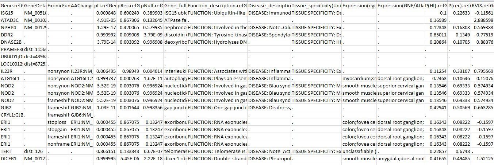
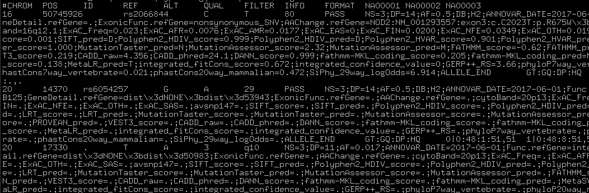

## A useful tutorial

In summer 2020, I taught an online training course that provides some materials for absolute beginners, including those who use personal Windows and Mac laptop computers, rather than Linux servers. The tutorial requires that you install conda in your personal computer, and it can be access [here](https://github.com/WGLab/Workshop_Annotation). Some users may find it useful. However, if you are already using a computing cluster and are already familiar with Linux, you do not need to follow this tutorial and can instead just read below.


## table_annovar.pl

For beginners, the easiest way to use ANNOVAR is to use the `table_annovar.pl` program. This program takes an input variant file (such as a VCF file) and generate a tab-delimited output file with many columns, each representing one set of annotations. Additionally, if the input is a VCF file, the program also generates a new output VCF file with the INFO field filled with annotation information.

Assume that we have downloaded ANNOVAR package and used `tar xvfz annovar.latest.tar.gz` to unpack the package. You will see that the `bin/` directory contains several Perl programs with .pl suffix. (Note that if you already added ANNOVAR path into your system executable path, then typing `annotate_variation.pl` would be okay instead of typing `perl annotate_variation.pl`). First, we need to download appropriate database files using `annotate_variation.pl`, and next we will run the `table_annovar.pl` program to annotate the variants in the `example/ex1.avinput` file.

```
[kaiwang@biocluster ~/]$ annotate_variation.pl -buildver hg19 -downdb -webfrom annovar refGene humandb/

[kaiwang@biocluster ~/]$ annotate_variation.pl -buildver hg19 -downdb cytoBand humandb/

[kaiwang@biocluster ~/]$ annotate_variation.pl -buildver hg19 -downdb -webfrom annovar exac03 humandb/ 

[kaiwang@biocluster ~/]$ annotate_variation.pl -buildver hg19 -downdb -webfrom annovar avsnp147 humandb/ 

[kaiwang@biocluster ~/]$ annotate_variation.pl -buildver hg19 -downdb -webfrom annovar dbnsfp30a humandb/

[kaiwang@biocluster ~/]$ table_annovar.pl example/ex1.avinput humandb/ -buildver hg19 -out myanno -remove -protocol refGene,cytoBand,exac03,avsnp147,dbnsfp30a -operation gx,r,f,f,f -nastring . -csvout -polish -xref example/gene_xref.txt
```

Run the above commands one by one. The first a few commands download appropriate databases into the `humandb/` directory. The final command run TABLE_ANNOVAR, using ExAC version 0.3 (referred to as exac03) dbNFSP version 3.0a (referred to as dbnsfp30a), dbSNP version 147 with left-normalization (referred to as avsnp147) databases and remove all temporary files, and generates the output file called `myanno.hg19_multianno.txt`. Fields that does not have any annotation will be filled by "." string. Open the output file in Excel and see what it contains. The expected output file that I generated can be downloaded here: [ex1.hg19_multianno.csv](http://www.openbioinformatics.org/annovar/download/ex1.hg19_multianno.csv). A screen shot of the first a few columns is shown below:


The output file contains multiple columns. The first a few columns are your input column. Each of the following columns corresponds on one of the "protocol" that user specified in the command line. The Func.refGene, Gene.refGene, GeneDetail.refGene, ExonicFunc.refGene, AAChange.refGene columns contain various annotation on how the mutations affect gene structure. The Xref.refGene column contains cross-reference for the gene; in this case, whether a known genetic disease is caused by defects in this gene (this information was supplied in the `example/gene_xref.txt` file in the command line). For the next a few columns, the ExAC\* columns represent allele frequency in all the samples as well as sub-populations in the Exome Aggregation Consortium data sets, while the avsnp147 means the SNP identifier in the dbSNP version 147. The other columns contains prediction scores for non-synonymous variants using several widely used tools, including SIFT scores, PolyPhen2 HDIV scores, PolyPhen2 HVAR scores, LRT scores, MutationTaster scores, MutationAssessor score, FATHMM scores, GERP++ scores, CADD scores, DANN scores, PhyloP scores and SiPhy scores and so on. 

We can examine the command line in greater detail. The `-operation` argument tells ANNOVAR which operations to use for each of the protocols: `g` means gene-based, `gx` means gene-based with cross-reference annotation (from `-xref` argument), `r` means region-based and `f` means filter-based. If you do not provide a xref file, then the operation can be `g` only. You will find details on what are gene/region/filter-based annotations in the other web pages. Sometimes, users want tab-delimited files rather than comma-delimited files. This can be easily done by removing `-csvout` argument to the above command.

In the command above, we used `-xreffile` argument to provide annotation to genes. If the file contains header line, it is possible to provide mulitple pieces of annotations to genes (rather than just one single column). To illustrate this, we can check the first two lines (including the header line) of the `example/gene_fullxref.txt` file:

```
[kaiwang@biocluster ~/project/annotate_variation]$ head -n 2 example/gene_fullxref.txt
#Gene_name      pLi     pRec    pNull   Gene_full_name  Function_description    Disease_description     Tissue_specificity(Uniprot)     Expression(egenetics)  Expression(GNF/Atlas)    P(HI)   P(rec)  RVIS    RVIS_percentile GDI     GDI-Phred
A1BG    9.0649236354772e-05     0.786086131023045       0.2138232197406 alpha-1-B glycoprotein  .       .       TISSUE SPECIFICITY: Plasma.;    unclassifiable (Anatomical System);amygdala;prostate;lung;islets of Langerhans;liver;spleen;germinal center;brain;thymus;       fetal liver;liver;fetal lung;trigeminal ganglion;       0.07384 0.31615 -0.466531444    23.51380042     79.3774 1.88274
```

The header line starts with `#`. The cross-reference file then contains 15 types of annotations for genes. You can run the same command above but change `-xreffile` from `gene_xref.txt` to `gene_fullxref.txt`, and the result file can be downloaded from [here](http://www.openbioinformatics.org/annovar/download/ex1.hg19_multianno.csv). Part of the file is shown below to give users an example:



Since ANNOVAR includes dbNSFP4.2a and dbNSFP4.2c now, you can try change the command above to use the latest version. Similarly, since ANNOVAR supports gnomAD now, you do not need to use exac03, but instead use gnomad211_exome which is the version 2.1.1.

`table_annovar.pl` can directly support input and output of VCF files (the annotation will be written to the INFO field of the output VCF file). Let's try this:

```
[kaiwang@biocluster ~/]$ table_annovar.pl example/ex2.vcf humandb/ -buildver hg19 -out myanno -remove -protocol refGene,cytoBand,exac03,avsnp147,dbnsfp30a -operation g,r,f,f,f -nastring . -vcfinput -polish
```

You can download the output file here: [ex2.hg19_multianno.vcf](http://www.openbioinformatics.org/annovar/download/myanno.hg19_multianno.vcf). Additionally, a tab-delimited output file is also available as [ex2.hg19_multianno.txt](http://www.openbioinformatics.org/annovar/download/ex2.hg19_multianno.txt), which contains similar information in a different format. You can open the new VCF file in a text editor and check what has been changed in the file: the INFO field in the VCF file now contains annotations that you need, starting with the string ANNOVAR_DATE and ending with the notation ALLELE_END. If multiple alleles are in the same locus, you will see multiple such notations in the INFO field. A screen shot is shown below:



Some people want to have the HGVS formatted strings for not only exonic variant, but also intronic variant that could be say 10bp away from splice site (by default, ANNOVAR only treats variants within 2bp of exon/intron boundary as splice variants, unless a --slicing_threshold parameter is set). So you can specify this using the command below:

```
[kaiwang@biocluster ~/]$ table_annovar.pl example/ex2.vcf humandb/ -buildver hg19 -out myanno -remove -protocol refGene,cytoBand,exac03,avsnp147,dbnsfp30a -operation g,r,f,f,f  -nastring . -vcfinput -polish -intronhgvs
```

Finally, for each protocol/operation, you can add extra argument, and it has the same comma-delimited format. For example, you can add `-hgvs` argument to the `refGene` annotation so that the output is in HGVS format (c.122C>T rather than c.C122T). There are the same number of arguments in -arg as in -protocol and -operation.

```
[kaiwang@biocluster ~/]$ table_annovar.pl example/ex2.vcf humandb/ -buildver hg19 -out myanno -remove -protocol refGene,cytoBand,exac03,avsnp147,dbnsfp30a -operation g,r,f,f,f -arg '-hgvs',,,, -nastring . -vcfinput -polish
```


Hopefully, after you finish this set of exercises above, you now have a better idea what ANNOVAR is, and can start enjoy the journey of annotating your variants.

## annotate_variation.pl

The `annotate_variation.pl` program is the core program in ANNOVAR. We can go to the ANNOVAR directory, then run the following three commands one by one. 

```
annotate_variation.pl -geneanno -dbtype refGene -buildver hg19 example/ex1.avinput humandb/

annotate_variation.pl -regionanno -dbtype cytoBand -buildver hg19 example/ex1.avinput humandb/ 

annotate_variation.pl -filter -dbtype exac03 -buildver hg19 example/ex1.avinput humandb/
```

Note that these three commands correspond to gene-based, region-based and filter-based annotations.

The first command annotates the 12 variants in `ex1.avinput` file and classify them as intergenic, intronic, non-synonymous SNP, frameshift deletion, large-scale duplication, etc. Examine the `ex1.avinput` file to see the simple text format, one variant per line. The annotation procedure should take a few seconds in a typical modern computer. Two output files are generated as `ex1.avinput.variant_function` and `ex1.avinput.exonic_variant_function`. Examine the two output files in `example/` directory to see what they contain: In the `variant_function` file, the first and second column annotate variant effects on gene structure and the genes that are affected, yet the other columns are reproduced from input file. In the `exonic_variant_function` file, the first, second and third column annotate variant line number in input file, the variant effects on coding sequences and the gene/transcript being affected, yet the other columns are reproduced from input file.

Next, the program annotates variants in `ex1.avinput` file and idenifies the cytogenetic band for these variants. The annotation procedure should take a few seconds. Examine the output file `ex1.avinput.hg19_cytoBand` to see what it contains. The first column shows `cytoBand`, the second column shows the annotation results, and the other columns are reproduced from input file.

Next, the program identifies a subset of variants in `ex1.avinput` that are not observed in exac03 database (saved in `ex1.avinput.hg19_exac03_filtered`) and those that are observed with allele frequencies (saved in `ex1.avinput.hg19_exac03_dropped` file).

>*Technical Notes: By default, ANNOVAR annotates variant on hg18 (human genome NCBI build 36) coordinate. Since the input file is in hg19 coordinate, we added `-buildver hg19` in every command above. Similarly, if you generated variant calls from human GRCh38 coordinate, add `-buildver hg38` in every command, if your variant file is from fly, add `-buildver dm3` in every command that you use; if your variant file is from mouse, add `-buildver mm9` in every command that you use ......*

The commands above represent a set of basic examples on how ANNOVAR can help researchers annotate genetic variants generated from high-throughput sequencing data. If you are interested, click the banner to the left to learn the input formats and see what additional things ANNOVAR can do for your research...

## Additional resources

A step-by-step protocol on using ANNOVAR and wANNOVAR is available at the reference below

Yang H, Wang K. [Genomic variant annotation and prioritization with ANNOVAR and wANNOVAR](http://www.nature.com/nprot/journal/v10/n10/abs/nprot.2015.105.html) _Nature Protocols_, 10:1556-1566, 2015


---

<script>
  (function(i,s,o,g,r,a,m){i['GoogleAnalyticsObject']=r;i[r]=i[r]||function(){
  (i[r].q=i[r].q||[]).push(arguments)},i[r].l=1*new Date();a=s.createElement(o),
  m=s.getElementsByTagName(o)[0];a.async=1;a.src=g;m.parentNode.insertBefore(a,m)
  })(window,document,'script','//www.google-analytics.com/analytics.js','ga');

  ga('create', 'UA-48623707-1', 'openbioinformatics.org');
  ga('send', 'pageview');
</script>

<script>
  (function(i,s,o,g,r,a,m){i['GoogleAnalyticsObject']=r;i[r]=i[r]||function(){
  (i[r].q=i[r].q||[]).push(arguments)},i[r].l=1*new Date();a=s.createElement(o),
  m=s.getElementsByTagName(o)[0];a.async=1;a.src=g;m.parentNode.insertBefore(a,m)
  })(window,document,'script','//www.google-analytics.com/analytics.js','ga');

  ga('create', 'UA-48623707-1', 'openbioinformatics.org');
  ga('send', 'pageview');
</script>

<div id="disqus_thread"></div>
<script type="text/javascript">
    /* * * CONFIGURATION VARIABLES * * */
    var disqus_shortname = 'annovar';
    var disqus_identifier = 'startup';
    var disqus_title = 'Quick Start-Up Guide';
    
    /* * * DON'T EDIT BELOW THIS LINE * * */
    (function() {
        var dsq = document.createElement('script'); dsq.type = 'text/javascript'; dsq.async = true;
        dsq.src = '//' + disqus_shortname + '.disqus.com/embed.js';
        (document.getElementsByTagName('head')[0] || document.getElementsByTagName('body')[0]).appendChild(dsq);
    })();
</script>
<noscript>Please enable JavaScript to view the <a href="https://disqus.com/?ref_noscript" rel="nofollow">comments powered by Disqus.</a></noscript>
