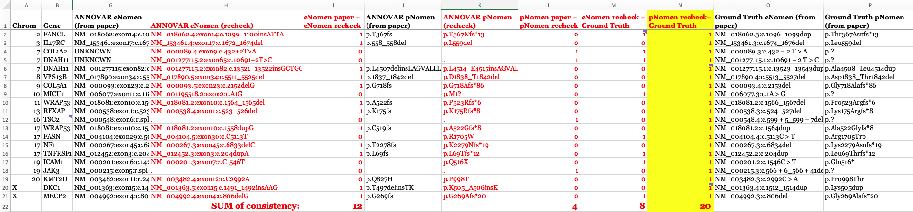

## A useful tutorial

In summer 2020, I taught an online training course that provides some materials for absolute beginners, including those who use personal Windows and Mac laptop computers, rather than Linux servers. The tutorial requires that you install conda in your personal computer, and it can be access [here](https://github.com/WGLab/Workshop_Annotation). Some users may find it useful. However, if you are already using a computing cluster and are already familiar with Linux, you do not need to follow this tutorial and can instead just read below.


## Download and install

The latest version of ANNOVAR can be downloaded [here](https://www.openbioinformatics.org/annovar/annovar_download_form.php) (registration required). If you have any issue or question about downloading ANNOVAR, plase refer to [Download ANNOVAR](https://annovar.openbioinformatics.org/en/latest/user-guide/download/) for more details.

When you have requested the ANNOVAR from the website and downloaded it, you will receive a compressed file `annovar.latest.tar.gz`, you will need to unzip it.

```
tar -xvzf annovar.latest.tar.gz
```

Once you unzip it, the annovar package will show up as a folder `annovar` and it will contains at least these files and folders:
```
annotate_variation.pl
coding_change.pl
convert2annovar.pl
example
humandb
retrieve_seq_from_fasta.pl
table_annovar.pl
variants_reduction.pl
``` 

In the `annovar` folder, the files end with `.pl` are the perl scripts that we could run. The `example` contains different input file examples. The `humandb` is our warehouse, it stores all the annotation databases that ANNOVAR can directly call and annotate.

## Run ANNOVAR

By default, the ANNOVAR provide you with a very small example vcf file and basic annotation for you to run. We will use `ex2.vcf` in `example` as input, and run gene annotation using `table_annovar.pl`. `table_annovar.pl` takes an input variant file (such as a VCF file directly) and generate a tab-delimited output file with many columns, each representing one set of annotations. Additionally, if the input is a VCF file, the program also generates a new output VCF file with the INFO field filled with annotation information. To print the help message for all perl scripts, simply run the script using either `./table_annovar.pl` or `perl table_annovar.pl`.

Let's run our first ANNOVAR. 

```
perl table_annovar.pl example/ex2.vcf \
  humandb/ \
  -buildver hg19 \
  -out my_first_anno \
  -protocol refGeneWithVer \
  -operation g \
  -remove -polish -vcfinput -nastring .
```

Results will be in `my_first_anno.hg19_multianno.txt` and `my_first_anno.hg19_multianno.vcf`. This simpliest eample could let you get gene annotation for each variants, but if you want to get more functional annotations, you will need to download additional database.


## Download additional database

The `humandb` is our warehouse, it stores all the preprocessed databases of interest so ANNOVAR know how to annotate the variants based on the annotation we required. We need to download appropriate database files using `annotate_variation.pl`. Before download, we need to decide what database we want to use:
- genome build (e.g., `hg19` or `hg38`) 
- annotation (e.g., `gnomad` or `clinvar`)
- version (e.g. `clinvar_20240917` or `clinvar_20240611`)

Please check all available database for ANNOVAR in [ANNOVAR addional database page](https://annovar.openbioinformatics.org/en/latest/user-guide/download/#additional-databases). 

Example of downloading additional database, and run ANNOVAR using these database (Note that if you already added ANNOVAR path into your system executable path, then typing `annotate_variation.pl` would be okay instead of typing `perl annotate_variation.pl`).

```
annotate_variation.pl -buildver hg19 -downdb -webfrom annovar refGeneWithVer humandb/
annotate_variation.pl -buildver hg19 -downdb cytoBand humandb/
annotate_variation.pl -buildver hg19 -downdb -webfrom annovar gnomad211_exome humandb/ 
annotate_variation.pl -buildver hg19 -downdb -webfrom annovar avsnp151 humandb/ 
annotate_variation.pl -buildver hg19 -downdb -webfrom annovar dbnsfp47a humandb/
```

```
table_annovar.pl example/ex1.avinput \
  humandb/ \
  -buildver hg19 \
  -out ex1_anno \
  -protocol refGeneWithVer,cytoBand,gnomad211_exome,avsnp151,dbnsfp47a \
  -operation gx,r,f,f,f \
  -xref example/gene_xref.txt \
  -remove -nastring . -csvout -polish
```

Run the above commands one by one. The first a few commands download appropriate databases into the `humandb/` directory using `annotate_variation.pl`. The final command run TABLE_ANNOVAR, using following databases:
- gnomAD exome collection version 2.1.1 (referred to as gnomad211_exome)
- dbSNP version 151  (referred to as avsnp151)
- dbNFSP version 4.7a (referred to as dbnsfp47a)

We also remove all temporary files (`-remove`), and generate the output file called `myanno.hg19_multianno.csv` (becausse we use `-csvout`). Fields that do not have any annotation will be filled by "." string (`-nastring .`). 

We can examine the command line in greater detail. The `-operation` argument tells ANNOVAR which operations to use for each of the protocols: `g` means gene-based, `gx` means gene-based with cross-reference annotation (from `-xref` argument), `r` means region-based and `f` means filter-based. If you do not provide a xref file, then the operation can be `g` only. You will find details on what are gene/region/filter-based annotations in the other web pages. Sometimes, users want tab-delimited files rather than comma-delimited files. This can be easily done by removing `-csvout` argument to the above command.

Open the output file in Excel and see what it contains. The expected output file that I generated can be downloaded here: [ex1.hg19_multianno.csv](https://github.com/WGLab/doc-ANNOVAR/releases/download/new_files_update/ex1_new.hg19_multianno.csv). A screen shot of the first a few columns is shown below:


The output file contains multiple columns. The first a few columns are your input columns, you could check `example/ex1.avinput` to see what it looks like. Each of the following columns corresponds on one of the "protocol" that user specified in the command line. The *Func.refGene, Gene.refGene, GeneDetail.refGene, ExonicFunc.refGene, AAChange.refGene* columns contain various annotation on how the mutations affect gene structure. The *Xref.refGene* column contains cross-reference for the gene; in this case, whether a known genetic disease is caused by defects in this gene (this information was supplied in the `example/gene_xref.txt` file in the command line). For the next serverals columns, the *AF*\* columns represent different allele frequency (AF) in gnomAD v2.1.1 database. The column *avsnp151* means the SNP identifier in the dbSNP version 151. The rest of the columns are from `dbnsfp47a` annotation, which contain pathogenic classification (end with `_pred`) or predicted score (end with `_score` or `_rankscore`) from several widely used tools, including AlphaMissense, MetaRNN, SIFT scores, PolyPhen2 HDIV scores, PolyPhen2 HVAR scores, LRT scores, MutationTaster scores, MutationAssessor score, FATHMM scores, GERP++ scores, CADD scores, DANN scores, PhyloP scores and SiPhy scores and so on. 

In the command above, we used `-xref` argument to provide annotation to genes. If the file contains header line, it is possible to provide mulitple pieces of annotations to genes (rather than just one single column). To illustrate this, we can check the first two lines (including the header line) of the `example/gene_fullxref.txt` file:

```
head -n 2 example/gene_fullxref.txt
```
```
#Gene_name      pLi     pRec    pNull   Gene_full_name  Function_description    Disease_description     Tissue_specificity(Uniprot)     Expression(egenetics)  Expression(GNF/Atlas)    P(HI)   P(rec)  RVIS    RVIS_percentile GDI     GDI-Phred
A1BG    9.0649236354772e-05     0.786086131023045       0.2138232197406 alpha-1-B glycoprotein  .       .       TISSUE SPECIFICITY: Plasma.;    unclassifiable (Anatomical System);amygdala;prostate;lung;islets of Langerhans;liver;spleen;germinal center;brain;thymus;       fetal liver;liver;fetal lung;trigeminal ganglion;       0.07384 0.31615 -0.466531444    23.51380042     79.3774 1.88274
```

The header line starts with `#`. The cross-reference file then contains 15 types of annotations for genes. 

You can run the same command above but change `-xref` from `gene_xref.txt` to `gene_fullxref.txt`, and the result file can be downloaded from [here](https://github.com/WGLab/doc-ANNOVAR/releases/download/new_files_update/ex1_new_xreffile.hg19_multianno.csv). Part of the file is shown below to give users an example:


Similarly, you could run `table_annovar.pl` with the same annotations directly using **VCF file** as input. For example:

```
table_annovar.pl example/ex2.vcf \
  humandb/ \
  -buildver hg19 \
  -out ex2_anno \
  -protocol refGeneWithVer,cytoBand,gnomad211_exome,avsnp151,dbnsfp47a \
  -operation gx,r,f,f,f \
  -xref example/gene_xref.txt \
  -remove -nastring . -polish \
  -vcfinput
```

Result will be written to `myanno.hg19_multianno.txt` (not a csv file because we did not put `-csvout` tag) and `myanno.hg19_multianno.vcf`.

You can download the output file here: [ex2.hg19_multianno.vcf](https://github.com/WGLab/doc-ANNOVAR/releases/download/new_files_update/ex2_new.hg19_multianno.vcf). Additionally, a tab-delimited output file is also available as [ex2.hg19_multianno.txt](https://github.com/WGLab/doc-ANNOVAR/releases/download/new_files_update/ex2_new.hg19_multianno.txt), which contains similar information in a different format. You can open the new VCF file in a text editor and check what has been changed in the file: the INFO field in the VCF file now contains annotations that you need, starting with the string ANNOVAR_DATE and ending with the notation ALLELE_END. If multiple alleles are in the same locus, you will see multiple such notations (muleiple "ANNOVAR_DATE ... ALLELE_END" sections) in the INFO field. A screen shot is shown below:


### Additional parameters options

Some people want to have the HGVS formatted strings for not only exonic variant, but also intronic variant that could be say 10bp away from splice site (by default, ANNOVAR only treats variants within 2bp of exon/intron boundary as splice variants, unless a `--slicing_threshold` parameter is set). For `-intronhgvs`, you will need to provide an integer which will then print HGVS notations for intron within this threshold away from exon. In here, we use `-intronhgvs 20`, it means anything within 20bp of intron/exon boundary will have the HGVS notation. for So you can specify this using the command below:

```
table_annovar.pl example/ex2.vcf \
  humandb/ \
  -buildver hg19 \
  -out myanno \
  -remove \
  -protocol refGeneWithVer,cytoBand,gnomad211_exome,avsnp151,dbnsfp47a \
  -operation g,r,f,f,f  \
  -nastring . \
  -vcfinput -polish \
  -intronhgvs 20
```

Finally, for each protocol/operation, you can add extra argument, and it has the same comma-delimited format. For example, you can add `-hgvs` argument to the `refGene` annotation so that the output is in HGVS format (c.122C>T rather than c.C122T). There are the same number of arguments in -arg as in -protocol and -operation.

```
table_annovar.pl example/ex2.vcf \
  humandb/ \
  -buildver hg19 \
  -out myanno \
  -remove \
  -protocol refGeneWithVer,cytoBand,gnomad211_exome,avsnp151,dbnsfp47a \
  -operation g,r,f,f,f \
  -arg '-hgvs',,,, \
  -nastring . -vcfinput -polish
```


## Annotate exome VCF file

In this section, we will show how to run ANNOVAR annotation on human exome VCF file, consider both intronic and exonic regions. To make our files more organized, let's create a folder to store our file and result by `mkdir mywork`. We need to download the data we need, we can run this command to download the data into `mywork/`:

```
wget http://molecularcasestudies.cshlp.org/content/suppl/2016/10/11/mcs.a001131.DC1/Supp_File_2_KBG_family_Utah_VCF_files.zip \
  -O mywork/Supp_File_2_KBG_family_Utah_VCF_files.zip
```

To give some background information, this is a zip file as supplementary material of a published paper on exome sequencing of a family with undiagnosed genetic diseases. Through analysis of the exome data, the proband was confirmed to have KBG syndrome, a disease caused by loss of function mutations in ANKRD11 gene. There are several VCF files contained in the zip file, including those for parents, silings and the proband. We will only analyze proband in this exercise, but if you are interested, you may want to check whether this is a de novo mutation by analyzing parental genomes.

Then we can unzip it and take a look what it contains:

```
proband.vcf  Unaffected_brother.vcf  Unaffected_father.vcf  Unaffected_mother.vcf  Unaffected_sister1.vcf  Unaffected_sister2.vcf
```

Because this vcf file used hg19 as reference, we will need to use the databases corresponding to hg19 genome build for proper results. If you have followed our tutorial, you should already have most of the databases already, expect `clinvar_20240611`. Please run command below to download the databases you don't have:

```
annotate_variation.pl -buildver hg38 -downdb -webfrom annovar clinvar_20240611 humandb/
annotate_variation.pl -buildver hg19 -downdb -webfrom annovar refGeneWithVer humandb/
annotate_variation.pl -buildver hg19 -downdb -webfrom annovar gnomad211_exome humandb/ 
annotate_variation.pl -buildver hg19 -downdb -webfrom annovar dbnsfp47a humandb/
```

Now we have all the input file and datasets we need, let's run `table_annovar.pl` on the exome sequencing of proband `proband.vcf`. We will want to have gene annotation (`refGeneWithVer` operation), ClinVar annotation (`clinvar_20240917` operation), gnomADv2.1.1 exome annotation (`gnomad211_exome` operation), and pathogenicity preditions from various tools (`dbnsfp47a` operation). 

Let's run our command:

```
table_annovar.pl mywork/VCF_files/proband.vcf\
  humandb/ \
  -buildver hg19 \
  -out mywork/proband.annovar \
  -remove \
  -protocol refGeneWithVer,clinvar_20240917,gnomad211_exome,dbnsfp47a \
  -operation g,f,f,f \
  -arg '-hgvs',,, \
  -polish -nastring . \
  -vcfinput \
  -intronhgvs 100
```

Note that we could give arguement for a specific operation, in here we use `-arg '-hgvs',,,` to the `refGeneWithVer` operation. Moreover, we use `-intronhgvs 100` tag seperately and give a range of 100 which means anywhere within 100 bp away from the intron/extron boundary will have HGVS format annotation.

The results will be in `proband.annovar.hg19_multianno.txt` and `proband.annovar.hg19_multianno.vcf` files, which contain annotations for this exome. 

We can use `less mywork/proband.annovar.hg19_multianno.txt` to check what the output looks like, you should have a result similar to this:


The screenshot showed us the complete columns and the first two variants. We see some familiar columns from our previous exmaple, such as variant basic information (first 5 columns), refGeneWithVer annotation, and gnomad AF columns, and some tool predictions columns from dbnsfp47a. The columns that start with `CLN` are from ClinVar annotation.

At this point, we have our results, and you could choose your own way of downstream analysis of these exome variants. But for demonstration purpose, we have provided a downstream analysis example in [advanced use case](./use_case.md) for exome VCF annotation. Downstream analysis includes chromosome distribution, variant type ditritbution, ClinVar pathogenicity distribution, CADD score, MetaRNN/AlphaMissense pathogenic predictions, etc.


## Gene Annotation Example

The purpose of this gene annotation example is to showcase how to perform a correct gene annotation using ANNOVAR, as a respond to this [paper (PMID 36268089)](https://www.sciencedirect.com/science/article/pii/S2153353922007246) which evaluated the ANNOVAR using 298 variants with ground truth of variant annotation. However, the authors might run ANNOVAR in inappropriate way so they had a wrong conclusion about ANNOVAR. Here we used the [exact vcf file they provided](https://github.com/WGLab/doc-ANNOVAR/releases/download/new_files_update/PMID_36268089.vcf) as a demo to show how to get the proper gene annotation (DNA change, amino acid change), with transcript version provided. Take a look at our vcf file first:

```
##fileformat=VCFv4.0
#CHROM	POS	ID	REF	ALT	QUAL	FILTER	INFO
2	162279995	.	C	G	.	.	.
2	162310909	.	T	C	.	.	.
1	11046609	.	T	C	.	.	.
19	19193983	.	A	T	.	.	.
7	147903589	.	T	C	.	.	.
17	82079248	.	G	A	.	.	.
10	63219963	.	G	C	.	.	.
13	101103286	.	T	A	.	.	.
```

There are 8 columns in a normal vcf file, and in this vcf file there is no quality score, id and other info, it only has the chromosome number, position, reference and alterantive allele, but this will be enough for ANNOVAR to run annotation.
Since we only interested in a very simple task: what is the cDNA and amino acid change (if possible) for these variants. We could run the following command:

```
perl table_annovar.pl mywork/PMID_36268089.vcf \
  humandb/ \
  -buildver hg38 \
  -out mywork/myanno_PMID_36268089 \
  -remove \
  -protocol refGeneWithVer \
  -operation g \
  -nastring . \
  -vcfinput \
  -polish
```

The output file of this command is provided [here](https://github.com/WGLab/doc-ANNOVAR/releases/download/new_files_update/myanno_PMID_36268089.hg38_multianno.txt). The first 5 columns describe the chromosome, position, reference allele and alterantive allele for each vairant. The gene name is the 7th column `Gene.refGeneWithVer`, as we can see 'IFIH1', 'MASP2' and 'RFXANK' were shown. For amino acid change of this variant, we could check the 10th column `AAChange.refGeneWithVer`, and it will tell us the amino acid change per transcript. Note that the first variant '2	162279995	162279995	C	G' does not have amino acid change becuase it is not in the protein coding region, instead it is in the 'splicing' region. And for the variant '1	11046609	11046609	T	C', there are two protein changes 'p.D120G' and 'p.D120G' and this is because there are 2 transcripts (isoforms) for this MASP2 variant, and in this case they are the same amino acid change in the same position, but sometimes you will see different position for amino acid change in different isoforms. 

After the annotation, we rechecked our result with the previous paper. The 20 variants provided in the screenshot below are the variants that the paper claimed ANNOVAR had incorrect annotations. The columns in red text are the new columns that we added for rechecking purpose, and the rest of the columns in black text were kept the same from the paper. The cDNA change is called "cNomen" and the amino acid change is called "pNomen" in the paper, so we will keep the same name. At the bottom, we summarize the consistency of ANNOVAR results that we got (cNomen/pNomen recheck), the ANNOVAR results from the paper (cNomen/pNomen paper), and the groud truth annotations based on the paper (Groud Truth). Given that one cDNA change could have various ways of interpretations, amino acid change is more resonable for comparison. At the last columns (highlighted in yellow), we checked our ANNOVAR annotation of amino acid change (pNomen) with the Groud Truth, and ANNOVAR showed 100% accuracy in terms of amino acid change. The version of transcript is provided in our ANNOVAR result as well because we used `refGeneWithVer` database.




Hopefully, after you finish this set of exercises above, you now have a better idea what ANNOVAR is, and can start enjoy the journey of annotating your variants.

If you are interesting in more advanced use of ANNOVAR, please refer to our [Advanced Use Case](./use_case.md). 


## Other information

>*Technical Notes: By default, ANNOVAR annotates variant on hg18 (human genome NCBI build 36) coordinate. Since the input file is in hg19 coordinate, we added `-buildver hg19` in every command above. Similarly, if you generated variant calls from human GRCh38 coordinate, add `-buildver hg38` in every command, if your variant file is from fly, add `-buildver dm3` in every command that you use; if your variant file is from mouse, add `-buildver mm9` in every command that you use ......*

The commands above represent a set of basic examples on how ANNOVAR can help researchers annotate genetic variants generated from high-throughput sequencing data. If you are interested, click the banner to the left to learn the input formats and see what additional things ANNOVAR can do for your research...

## Additional resources

A step-by-step protocol on using ANNOVAR and wANNOVAR is available at the reference below

Yang H, Wang K. [Genomic variant annotation and prioritization with ANNOVAR and wANNOVAR](http://www.nature.com/nprot/journal/v10/n10/abs/nprot.2015.105.html) _Nature Protocols_, 10:1556-1566, 2015


---

<script>
  (function(i,s,o,g,r,a,m){i['GoogleAnalyticsObject']=r;i[r]=i[r]||function(){
  (i[r].q=i[r].q||[]).push(arguments)},i[r].l=1*new Date();a=s.createElement(o),
  m=s.getElementsByTagName(o)[0];a.async=1;a.src=g;m.parentNode.insertBefore(a,m)
  })(window,document,'script','//www.google-analytics.com/analytics.js','ga');

  ga('create', 'UA-48623707-1', 'openbioinformatics.org');
  ga('send', 'pageview');
</script>

<script>
  (function(i,s,o,g,r,a,m){i['GoogleAnalyticsObject']=r;i[r]=i[r]||function(){
  (i[r].q=i[r].q||[]).push(arguments)},i[r].l=1*new Date();a=s.createElement(o),
  m=s.getElementsByTagName(o)[0];a.async=1;a.src=g;m.parentNode.insertBefore(a,m)
  })(window,document,'script','//www.google-analytics.com/analytics.js','ga');

  ga('create', 'UA-48623707-1', 'openbioinformatics.org');
  ga('send', 'pageview');
</script>

<div id="disqus_thread"></div>
<script type="text/javascript">
    /* * * CONFIGURATION VARIABLES * * */
    var disqus_shortname = 'annovar';
    var disqus_identifier = 'startup';
    var disqus_title = 'Quick Start-Up Guide';
    
    /* * * DON'T EDIT BELOW THIS LINE * * */
    (function() {
        var dsq = document.createElement('script'); dsq.type = 'text/javascript'; dsq.async = true;
        dsq.src = '//' + disqus_shortname + '.disqus.com/embed.js';
        (document.getElementsByTagName('head')[0] || document.getElementsByTagName('body')[0]).appendChild(dsq);
    })();
</script>
<noscript>Please enable JavaScript to view the <a href="https://disqus.com/?ref_noscript" rel="nofollow">comments powered by Disqus.</a></noscript>
